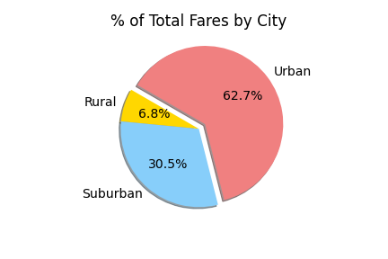

# PyBer_Analysis

## Project Overview
While working for the ride-sharing company Pyber, I have been tasked with performing an analysis on how different KPIs vary by different city types.  We will analyze variances in total ride numbers, number of drivers, and average as well as total fares for urban, suburban, and rural communities.
### Purpose  
The purpose of the analysis is to determine what communities, if any, we are not adequately serving and the reasons why these communities are not being reached.  By identifying weak areas, we hope the analysis can guide the company into the most efficient way to improve access and affordability to any underserved communities. 
## Resources 
- Data Sources: city_data.csv, drive_data.csv
- Software: Python 3.7, Jupyter Notebook v. 6.1.4
## Results

### Total Rides vs Average Fare
By summarizing the different KPIs into a single data frame comparing the different city types we can get a quick glimpse at how the data varies.  We can see the obvious result that as population of a community increases, so does the number of rides and the number of drivers.  We also notice that as the number of rides and drivers increases, the average fare per ride and the average fare per driver decreases. This negative relationship between number of rides and average fare per ride may be better seen in the following bubble chart showing the trend.
 

 
 Fares per ride in rural areas are on average $10 (29%) higher than in urban areas and about $4 (11%) higher than suburban areas, and total rides in rural areas were 1,500 (1200%) fewer than in urban areas and 500 (400%) fewer than in suburban areas.  It is clear to see the disparity between the different types of cities, but also clear that the difference in number of rides is much more drastic than the difference in average fares. The following box-and-whisker plots show average fare per ride distribution and ride count distribution across the different city types.  You can see that although average fare per ride is higher in rural cities there is still a lot of overlap of fare prices in the different city types.
  

### Driver Count vs. Average Fare per Driver
The distribution of total drivers more closely follows the distribution of total rides. However, the difference between the average number of drivers as well as the highest number of drivers in urban and rural cities is much more extreme that when looking at the number of rides.  Urban cities had far more drivers than rural, and we saw the average fare per driver was much higher in rural and suburban areas than in urban areas.  This may suggest that the best way to decrease fares may be to increase the number of drivers in urban areas. 

### Total Fare Earned
 

 
We can see in the line graph that the majority of fares paid to Pyber come from urban population centers, then suburban, and the smallest amount of fares come from rural cities.  Fares were mostly consistent for each city type for the months of January through March, with urban having a slight peak in late February and early March.  In April we have a drastic decrease in fares in suburban and especially urban cities.  The increase is so dramatic and sudden that it may be an error in the data, and this would be something to explore further.  If this drop in fares is not an error in the data we need to examine what events may have been occurring concurrently to cause the drop, because it does not look to have occurred naturally.
As was mentioned, most fares earned came from urban cities, then suburban, and finally rural.  With the following pie charts, we can see that urban cities actually brought in more fares than both rural and suburban cities combined, with a total of 62.7% of fares.  A little under a third of fares came from suburban cities, with 30.5% and rural brought in a meager 6.8% of fares earned by Pyber.  The second pie chart shows the proportions of total rides by the different city types, and we can see that they closely follow the proportions of fares. 
  

## Summary

