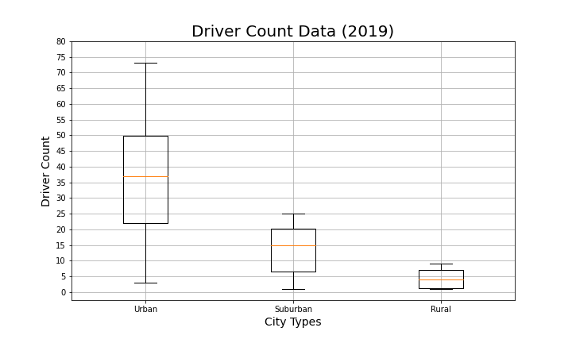

# PyBer_Analysis

## Project Overview
While working for the ride-sharing company Pyber, I have been tasked with performing an analysis on how different KPIs vary by different city types.  We will analyze variances in total ride numbers, number of drivers, as well as average and total fares for urban, suburban, and rural communities.
### Purpose  
The purpose of the analysis is to determine what communities, if any, are not being adequately served and the reasons why these communities are not being reached by the company.  By identifying weak areas, we hope the analysis can guide the company into the most efficient way to improve access and affordability to any underserved communities. 
## Resources 
- Data Sources: city_data.csv, drive_data.csv
- Software: Python 3.7, Jupyter Notebook v. 6.1.4
## Results

### Total Rides vs Average Fare
By summarizing the different KPIs into a single data frame comparing the different city types we can get a quick glimpse at how the data varies.  We can see the obvious result that as population of a community increases, so does the number of rides and the number of drivers.  We also notice that as the number of rides and drivers increases, the average fare per ride and the average fare per driver decreases. This negative relationship between number of rides and average fare per ride may be better seen in the following bubble chart showing the trend.
 

 
 Fares per ride in rural areas are on average $10 (29%) higher than in urban areas and about $4 (11%) higher than suburban areas, and total rides in rural areas were 1,500 (1200%) fewer than in urban areas and 500 (400%) fewer than in suburban areas.  It is clear to see the disparity between the different types of cities, but also clear that the difference in number of rides is much more drastic than the difference in average fares. The following box-and-whisker plots show average fare per ride distribution and ride count distribution across the different city types.  You can see that although average fare per ride is higher in rural cities there is still a lot of overlap of fare prices in the different city types.
 
  

### Driver Count vs. Average Fare per Driver
The distribution of total drivers more closely follows the distribution of total rides. However, the difference between the average number of drivers as well as the highest number of drivers in urban and rural cities is much more extreme that when looking at the number of rides.  Urban cities had far more drivers than rural, and we saw the average fare per driver was much higher in rural and suburban areas than in urban areas.  This may suggest that the best way to decrease fares may be to increase the number of drivers in urban areas. 

### Total Fare Earned

 
We can see in the line graph that the majority of fares paid to Pyber come from urban population centers, then suburban, and the smallest amount of fares come from rural cities.  Fares were mostly consistent for each city type for the months of January through March, with urban having a slight peak in late February and early March.  In April we have a drastic decrease in fares in suburban and especially urban cities.  The decrease is so dramatic and sudden that it may be an error in the data, and this would be something to explore further.  If this drop in fares is not an error in the data we need to examine what events may have been occurring concurrently to cause the drop, because it does not look to have occurred naturally.
As was mentioned, most fares earned came from urban cities, then suburban, and finally rural.  With the following pie charts, we can see that urban cities actually brought in more fares than both rural and suburban cities combined, with a total of 62.7% of fares.  A little under a third of fares came from suburban cities, with 30.5% and rural brought in a meager 6.8% of fares earned by Pyber.  The second pie chart shows the proportions of total rides by the different city types, and we can see that they closely follow the proportions of fares. 
  

## Summary
Since the goal of the analysis is to increase access and affordability of Pyber rides we will look primarily at rural and suburban cities.  Urban cities actually have more drivers than there were rides in the time period analyzed, so we will not be looking into improving access to riders in urban centers, but we may look into making rides more affordable.
 - My first recommendation would be to reach out to rural communities and attempt to increase the number of drivers in these cities.  Rural cities have about 1.6 rides per driver, while suburban cities only have 1.28 rides per driver and urban cities have 0.68 rides per driver.  We also saw that average fare per driver was over 200% higher in rural cities than urban cities.  Increasing the number of drivers in urban cities, and to a lesser extent suburban cities, should decrease fares and increase affordability.
 - Another important point to look is the range of fares in rural areas.  The lowest fares in urban areas are about $15, which is lower than the lowest suburban fares and not much higher than the lowest urban fares. The first quartile for rural fares is also at a similar level as urban and suburban fares.  However, the third quartile of fares and the highest fares are both significantly higher than either suburban or urban fares.  Pyber will want to investigate what the reason for such a large range of fares is in rural cities.  It may be due to the unavailability of drivers discussed in the first recommendation, but there may be additional factors leading to it.  We should look at average drive distance in the different types of cities to see if that may be the reason.  Urban cities are typically much larger in area than rural cities leading to longer drives, but we may see that many of our rural rides head out into country roads and out of town more, increasing the average drive distance.  If this is the case we may look at dividing the service into two different categories in rural cities, one where the ride will remain within city limits and one where it will leave town.  This may help keep fares down for in-city rides and improve accessibility and affordability in rural cities for those riders wanting to stay in town.
 - As we saw earlier, rural and suburban cities, where fares are higher, make up less than a third of total rides.  We also saw that average fare per driver is more than twice as high in suburban cities than in urban, and almost four times as high in rural cities than in urban ones.  This may be due to fares having to be higher in smaller cities for this to be an economically feasible gig for drivers.  Following the first two recommendations should increase the ride count, but we want to also increase marketing to rural and urban communities in an attempt to increase riders.  By increasing the number of riders and therefore rides, it should be possible for drivers to make a reasonable income without having to increase fares as much.  We have to be careful though, because the first recommendation of increasing drivers may clash with this one.  If we increase the number of drivers too much then we will still have the same problem of having to increase fares in order for drivers to be able to earn a reasonable income.

